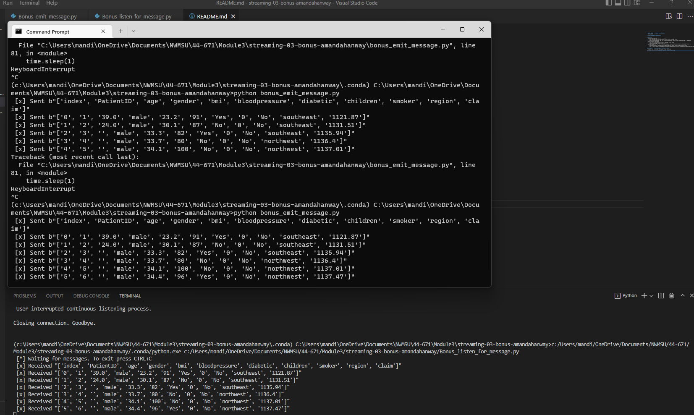

# Amanda Hanway - Streaming Data, Module 3
- Date: 1/21/23

# streaming-03-bonus-hanway

## Overview:
- Bonus_emit_message.py
    - This program reads data from a csv file 
    - then sends the data as a message to a queue on the RabbitMQ server
    - The script incorporates code from process_streaming.py (module 2) and v2_emit_message.py (module 3)
- Bonus_listen_for_message.py
    - This program continously listens for messages on the queue
    - and writes messages to an output file.
    - The incorporates code from process_streaming.py (module 2) and v2_listen_for_message.py (module 3)
- CSV Data Source
    - The insurance_data.csv file contains demographic and health factors from insurance claims
    - Link to source: https://www.kaggle.com/datasets/thedevastator/insurance-claim-analysis-demographic-and-health?resource=download

## Screenshot - Program Running in Multiple Terminals
- using VS Code (listening) and Command Prompt (emitting)

